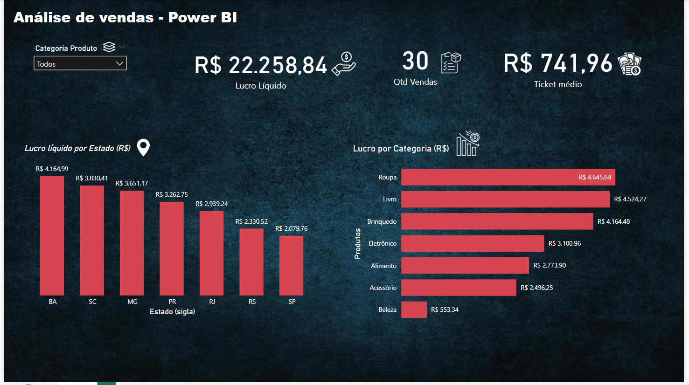

# 📊 Ecommerce Dashboard - Power BI

Este projeto consiste em um dashboard interativo desenvolvido no **Power BI**, com foco na análise de vendas de um e-commerce. 

---

## 🎯 Objetivo

Apresentar um painel de controle intuitivo e profissional, voltado para análise de:

- 🔢 Quantidade de Vendas
- 💰 Lucro Líquido
- 📈 Ticket Médio
- 🗂️ Lucro por Categoria
- 🗺️ Lucro por Estado

---

## 🧰 Ferramentas utilizadas

- Power BI Desktop
- DAX (Data Analysis Expressions)
- Limpeza e modelagem de dados no Power BI

---

## 🖼️ Visão Geral do Dashboard

---

## 🧠 Insights encontrados

- Os estados com maior lucro líquido foram Bahia (BA), Santa Catarina (SC) e Minas Gerais (MG).
- O ticket médio mais alto foi encontrado na categoria "Alimento".
- A categoria do produto que mais tem vendas em questão de quantidade é o "Brinquedo" com 7 vendas.

---

## 📬 Contato

- [LinkedIn](https://www.linkedin.com/in/kauansilva96/)
- Email: kauangsilva1996@gmail.com

